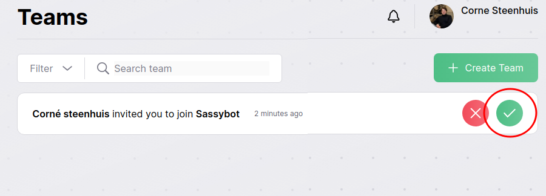
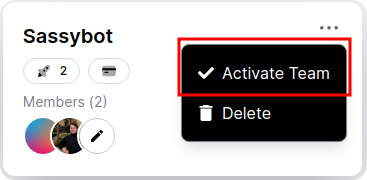

# Account & Teams

## Accessing your account
Because Raidflux is currently **invite only**, you will first have to receive an email from us containing your personal invitation. Once you receive this invitation, use the button in the invitation email to register an account.

After you created an account, Accept the invitation to your team using the green check button as shown below

Once you accepted the invitation, make sure that your team is selected by right clicking it and pressing “Activate team” as shown below

## Getting an invite
If you'd like to get access to Raidflux, please schedule a demo call with us from our [landing page](https://raidflux.com), contact us using our [contact form](https://raidflux.com/contact) or mail us via support@raidflux.com
