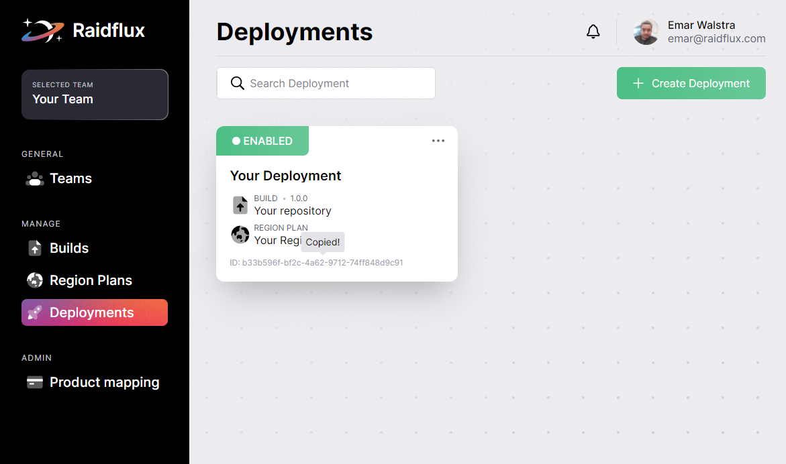

# Communicating with Raidflux
When you've uploaded your game, assigned a billing profile, created and enabled a deployment you're almost ready to start playing your game!
 
While the deployment is spinning up we can make sure the communication between your game and Raidflux can be established.  
**Copy the ID** of a deployment you've created by clicking on the text.

We will use the ID of your deployment to let your game discover motherships and the game servers  
that Raidflux launched when your deployment got enabled!  

### Choose your integration method below:  
**Unity:**  
[Discovery - Unity: own project ](../going-live/with-unity#discovery---unity-own-project)  
[Discovery - Unity: demo project](../going-live/with-unity#discovery---unity-demo-project)  

**Unreal Engine:**  
[Discovery - UE4: own project](../going-live/with-ue4)  
[Discovery - UE4: demo project](../going-live/with-ue4)