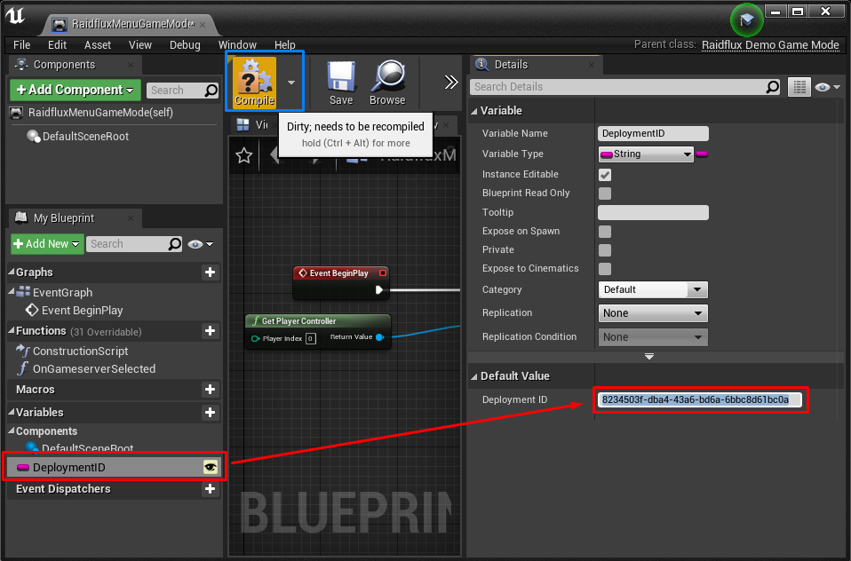
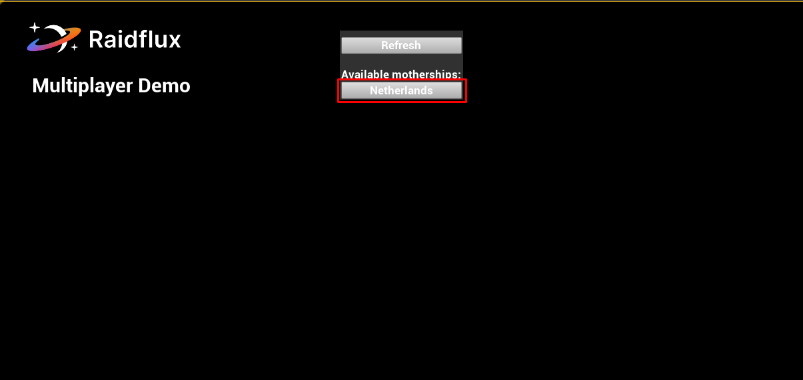
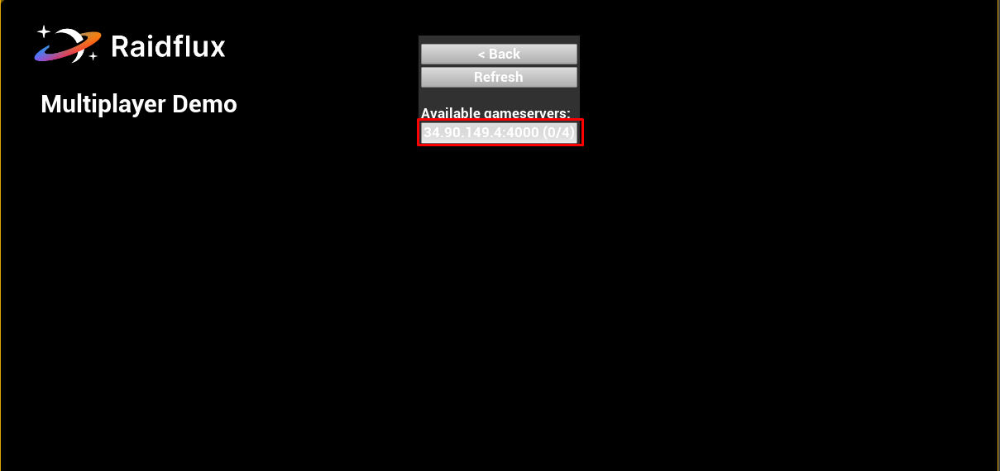

# Discovery with Unreal Engine 4

Before you can go live with your game we need to make sure your game and Raidflux can communicate with each other.  

If you use our demo project continue below, else continue [here](#discovery---unreal-engine-4-own-project)!


## Discovery - Unreal Engine 4: demo project

After you've copied the deployment ID from your **active** deployment, open the demo project and open ```Blueprints/RaidfluxMenuGameMode```. In the blueprint editor,  you can find a variable ```DeploymentID```. Paste your deployment ID in there and hit **"Compile"** as shown below.



If you want join the server, simply **press play** and look for the active mothership under **Available motherships**!  



Click on the active mothership and join the server!



:::important
If you don't see the mothership or gameserver yet, it might still be spinning up!  
If a mothership or game server don't show up after 5 minutes try to retrace your steps and see if something went wrong.   
:::

:::tip
If everything was done correctly but it's not working, feel free to contact us at support@raidflux.com and we'll help you out!
:::


## Discovery - Unreal Engine 4: own project

After you've copied the deployment ID from your **active** deployment, go to where you implemented the `URadflux::FetchMotherships(const FString& deploymentID, const FRaidfluxOnMothershipsFetched& onCompletedCallback)` function from [Integrating the client side](../unreal-engine-plugin/integrate/ue-client-side) and pass it in the expected string parameter!

**You're ready to enjoy your game now!**
