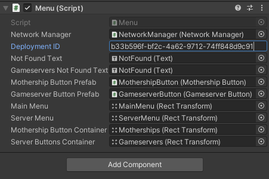
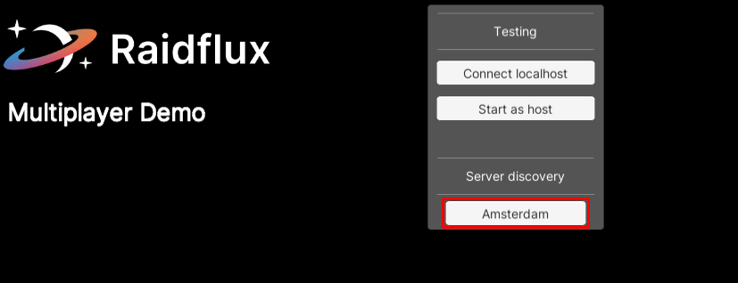
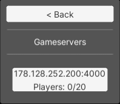

# Discovery with Unity
Before you can go live with your game we need to make sure your game and Raidflux can communicate with each other.  

If you use our demo project continue below, else continue [here](./with-unity#discovery---unity-own-project)!

## Discovery - Unity: demo project
After you've copied the deployment ID from your **active** deployment, go into the demo project and select the menu script in your   
**menu scene**. In the navigator, locate **Menu(script)**. Inside you can find a text field called "**Deployment ID**".  

Paste the deployment id into the text field and you're ready to go live!  

If you want join the server, simply **press play** in unity and look for the active mothership under **Server discovery**!  
  
**Click** on the active mothership and **join** the server!  

:::important
If you don't see the mothership or server yet might still be spinning up!  
If a mothership or game server don't show up after 5 minutes try to retrace your steps and see if something went wrong.   
:::
:::tip
You can refresh the menu by going back to the main menu and re-entering the mothership again.  

If everything was done correctly but it's not working, feel free to contact us at support@raidflux.com and we'll help you out!
:::

## Discovery - Unity: own project
After you've copied the deployment ID from your **active** deployment, go to where you implemented the `RaidfluxServer.Singleton.ListMotherships(string deploymentID, Action<List<Mothership>> onComplete)` function from [Integrating the client side](../unity-plugin\integrate\client-side.md) and paste it in the expected string field to be done!

**You're ready to enjoy your game now!**