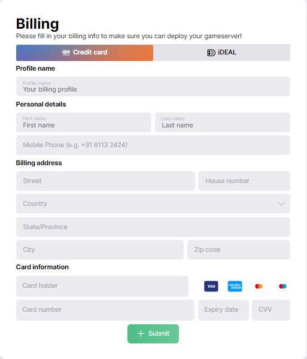

# Billing profiles

First go to [Teams](https://console.raidflux.com/dashboard/teams/) on the console.  

Go inside of the team you want to add a billing profile to and click on the billing button to create a billing profile.  
   
Choose your preferred payment method and fill in the form.  
  
After you've submitted the form, assign your  billing profile to your selected team by selecting the profile and clicking assign.

You're done adding a billing profile and you're **almost ready to go live**! 

Let's continue at [Enabling a deployment](../raidflux-console/deployments#enabling-a-deployment)!
