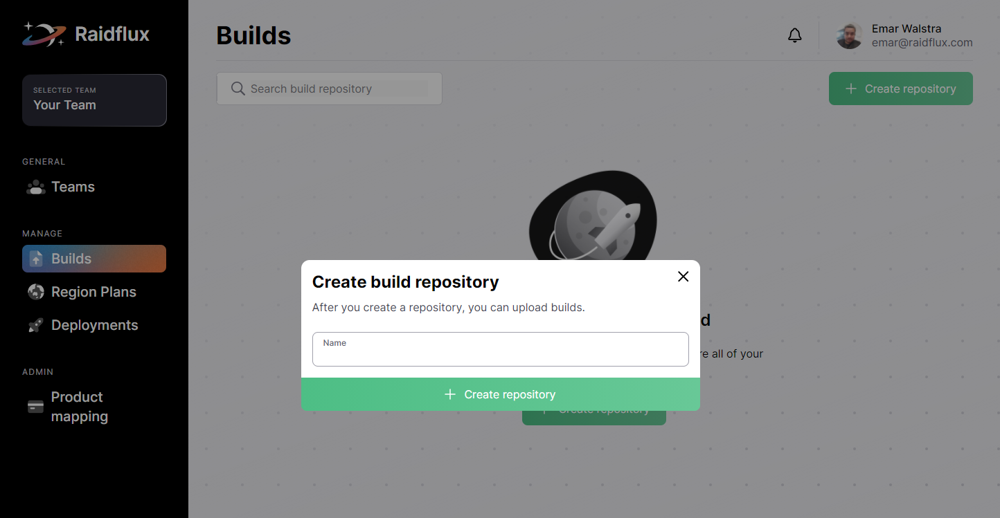
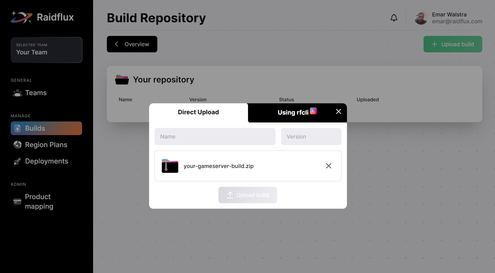

# Builds
This is where you will upload your builds in the build repository you will create!  
It's the perfect place to manage all of your builds.
## Uploading your build

Lets start by going to our [Builds page](https://console.raidflux.com/dashboard/builds) and **create** a new build repository!  
You can name the repository anything you'd like.

:::important
Make sure your gameserver build extension is **.ZIP**! other filetypes can't be uploaded to Raidflux.
:::
After you created a repository, you'll automatically get taken inside where you can upload the build zip file.  
Simply click the **Upload Build** button, drag 'n drop your **build.zip**, give your build a **name** and **version** and click **Upload build**!

You're done here! continue at [Creating a region plan](./region-plans#creating-a-region-plan)