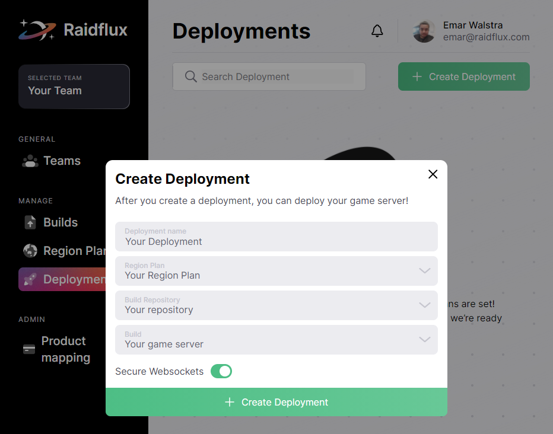
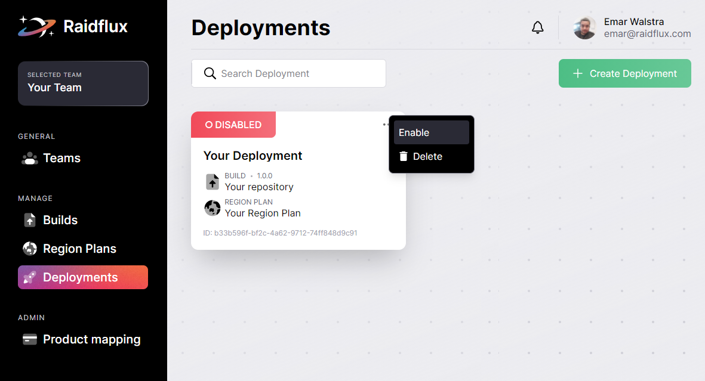

# Creating a deployment

Once you have uploaded your server build and your region plan has been created,  
it’s time to head over to [Deployments](https://console.raidflux.com/dashboard/deployments) on your dashboard.

Creating a deployment is very easy, you just have to **give it a name**, choose where you want to deploy by **selecting a region plan**, **selecting a build** from your preferred repository, and click on the **Create a Deployment button**! 
:::tip
If you're developing WebGames using WebSockets make sure you enable the Secure WebSocket feature! Raidflux allows you to use WSS/TLS protected WebSockets with the flick of a switch!
:::
:::important
If you're **NOT** trying to launch a game that makes use of WebSockets make sure the toggle is **DISABLED**. 
:::
  
:::important
If you've already created and assigned a billing profile continue below else go to [Billing profiles](../raidflux-console/adding-billing)!

**note**: It will **NOT** start charging you, after you've added a billing profile.
:::

## Enabling a deployment
You can enable your Deployment and launch your server, **click the 3 dots** in the top right of the deployment you've just created.  
Select **Enable**
this will spin up your servers!  

:::caution
If your deployment is **enabled** you'll be **charged hourly** and gets calculated by the amount of resources your infrastructure uses. 
**note**: You'll get an overview of your used resources and the total cost at the end of the month.
:::

:::tip
If you are in development and testing features in your game, we recommend **disabling** your servers when they're not being used! This prevents you from getting billed for unused resources and will keep testing/development cost low!  
Often not more than a couple of bucks a month! 

**Note:** your cost may differ based on your usage and machine types.
:::

Raidflux takes up to 5 minutes to spin up your servers, In the meantime lets continue at [Going Live!](../going-live/communicating-raidflux)
