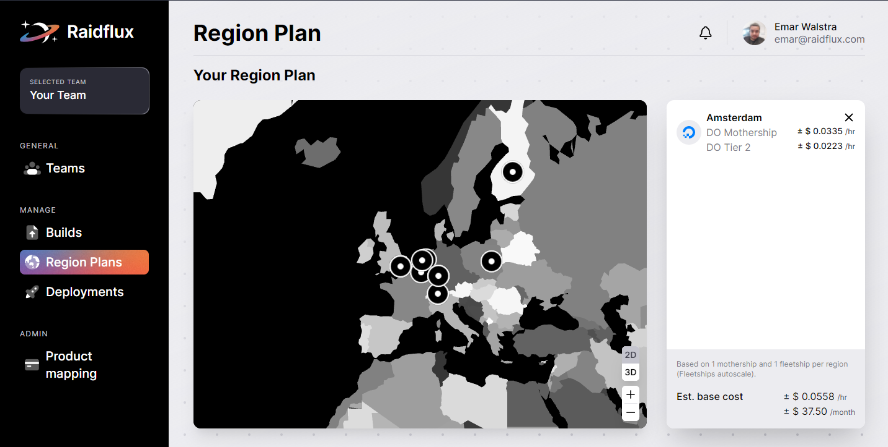

# Region plans

## What's a region plan
Region plans define where you want your game servers to be deployed at. You can select multiple regions around the world, the closer your players are to your selected region the lower latency they will experience. In every region you deploy a game server, there will be 2 server instances active by default. One is occupied by your **mothership**, and the other is occupied by a **fleetship**. The mothership will take full control of the region it is located at. When a fleetship's reaches it's maximum capacity the mothership of that region will send a new fleet ship to make sure there's enough game servers for your players. This works both directions, after players leave, the unused fleet ships will be removed so you won’t pay for resources your game doesn’t use. A fleetship is at maximum capacity when all game servers it’s hosting are filled by players. By default there will be at least 1 Fleetship ready to host your players at all times. The different Tiers provided in our region plan dictate the size , power and provider of the fleetships, this affects the spin up time and the amount of game servers it can host before the mothership needs to create a new fleetship.

:::tip

If you are at an early stage of release or if you’re still in development, we recommend creating a region plan that only consists of the location closest to you. This keeps the monthly cost low and gives you the opportunity to get early player feedback and test your game with the optimal game-play experience.
:::

## Creating a Region plan

Go to Region plans in the console or click [here](https://console.raidflux.com/dashboard/region-plans).

Lets start by creating a region plan, Click on **Create region plan** and give it a name.
  

Use the map to select the regions you wish to deploy. The locations offer Google or DigitalOcean servers and sometimes they offer both. We recommend starting with DigitalOcean servers since they are more affordable.  

There's a difference between Google and DigitalOcean machines, Google’s machines have a faster spin up time but DigitalOcean tends to be a cheaper option! 
For this example we will be using a DigitalOcean Tier 2 machine in Amsterdam because this fits the needs of our demo game. 
The Tier best for your game depends on the resources your game server uses. If you are not sure which tier/machine to choose, you can measure how much resources your game server uses when one's active and you open the resources tab in your task manager. Select a tier/machine that covers those resources and you should be fine. 
Once you are happy with your selection, you can select “Save plan”.  
:::important
You will **ONLY** be charged when your deployment has been **enabled**.  
Usage gets calculated **by the hour and billed monthly**.
:::

