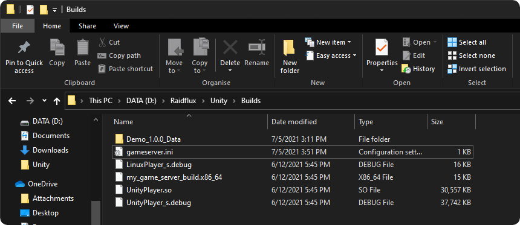

# Build target setup 

:::important
Raidflux **ONLY** works with Linux game server builds!  
Don't worry the game itself can be build for any target!   
If you're not on Linux make sure you've added **Linux Build Support (Mono)** to your Unity version!  
Want to know how to add Linux Build Support? go [here](../preparing-unity.md)!
:::


Go to **File** -> **Build settings** and select **Linux** as build target.
If the “Server build” checkbox is visible make sure it’s **checked** if it isn’t visible ignore it.  
  
**Build** the server and locate the build directory.  

**Create** a text file in the root of your build and change the name to "**gameserver**" and the file extension to "**.ini**".  

**Open** the gameserver.ini with a text editor and paste in the following lines:
```
[ports.udp] -: 7777

[entrypoint]
entrypoint = name_of_game_server_build.x86_64

[entrypoint.args]
-: -mlapi
-: server
```

Make sure the text behind ***entrypoint =*** is exactly the same as the name of your linux build, as shown below:
  

If done correctly, your build folder looks somewhat like this (your Linux build might have a different name):
  

Select everything in the folder and **compress** it into a **.ZIP** file.

You're done here, continue at [Uploading your build](../../uploading-your-build)