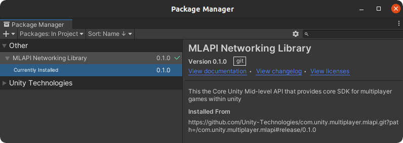
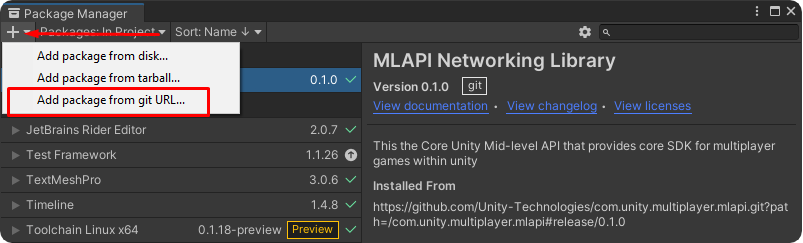
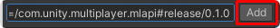
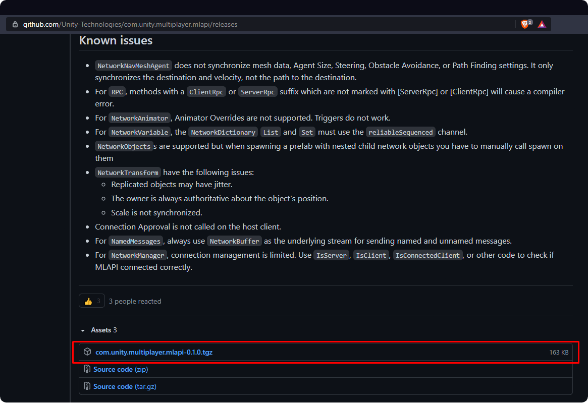
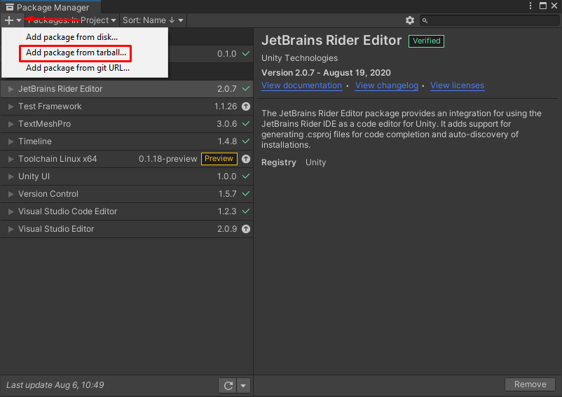
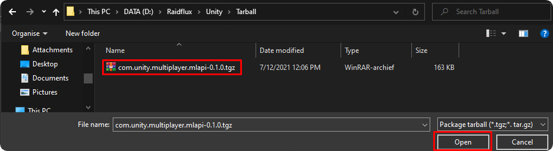

# Preparing the demo project

:::tip
If at any point you need help implementing Raidflux into your game, feel free to contact us at support@raidflux.com
:::
Lets start by downloading the [Demo project](https://github.com/Raidflux/raidflux-unity-demo) 

Let's open the demo project and make sure that the  **MLAPI Networking Library** is installed by navigating  
to **Window** -> **Package manager** and confirm if the package is installed like below.  
  

If you have git installed you can continue at [Installing MLAPI using GIT](#installing-mlapi-using-git)   
**OR**  
Continue at [Installing MLAPI without GIT](#installing-mlapi-without-git)

## Installing MLAPI using GIT
Go to your **Package Manager** in Unity, you can find it under the **window** tab, go to the **+** icon and click on **Add package from git URL** 

  

**Copy** this URL:
```
https://github.com/Unity-Technologies/com.unity.multiplayer.mlapi.git?path=/com.unity.multiplayer.mlapi#release/0.1.0
``` 

**Paste** it in the text field and click **add**    


You’re done! continue at [Building a game server](./building-game-server-demo)!

## Installing MLAPI without GIT
If you don’t have git installed on your machine, use [this](https://github.com/Unity-Technologies/com.unity.multiplayer.mlapi/releases) link to download the latest release from the MLAPI git page.  
  
Go to your **Package Manager** in Unity, you can find it under the **window** tab, go to the **+** icon and click on **Add package from tarball**.  
  

**Locate** the downloaded package and open it
  

You’re done! continue at [Building your game server](./building-game-server-demo)!
