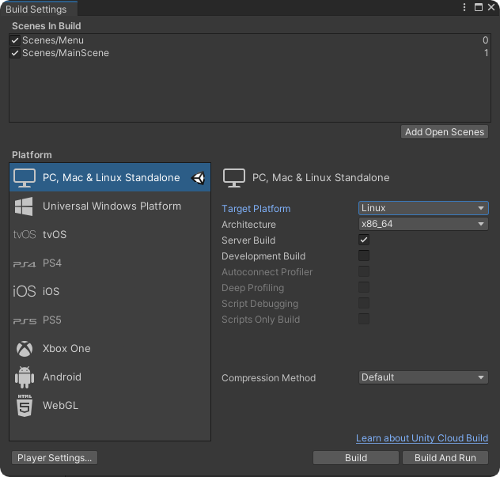
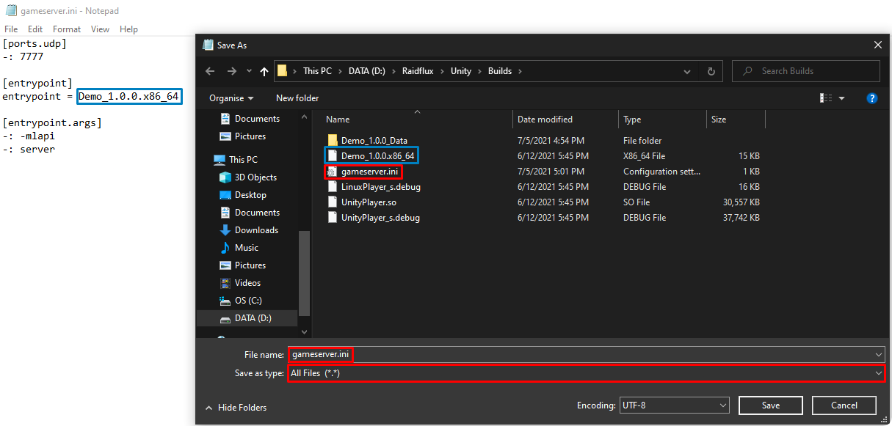
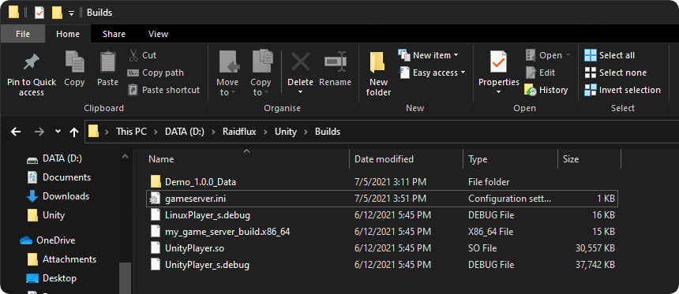

# Building your integrated game server

:::important
Raidflux **ONLY** works with Linux game server builds!  
Don't worry the game itself can be build for any target!   
If you're not on Linux make sure you've added **Linux Build Support (Mono)** to your Unity version!  
Want to know how to add Linux Build Support? go [here](../preparing-unity.md)!
:::
:::caution
This thread is for building a game server when you're integrating it into your own project!  
If you're using our demo project go [here](../demo/building-game-server-demo)
:::


Go to **File** -> **Build settings** and select **Linux** as build target.
If the “Server build” checkbox is visible  
make sure it’s **checked** if it isn’t visible ignore it.  
  
**Build** the server and locate the build directory.  

**Create** a text file in the root of your build and change the name to: 
```
gameserver.ini
```
Make sure the file extension changed to **.ini**.  
**Open** the gameserver.ini with a text editor and paste in the following lines:
```
[ports.udp] -: 7777

[entrypoint]
entrypoint = name_of_your_game_server_build.x86_64

[entrypoint.args]
-: -mlapi
-: server
```

Make sure the text behind ***entrypoint =*** is exactly the same as the name of your linux build, as shown below:
  

You can use the key `[ports.udp]` to specify the port your gameserver uses. Raidflux will use this to internally route traffic to your server. If your server uses TCP connections you can use the key `[ports.tcp]`. The ` [entrypoint]` key is used by Raidflux to locate your executable, **make sure this is set to the exact name of your executable**, this is case sensitive. If your server requires any command line arguments, you can use `[entrypoint.args]` to specify these. If you were not able to check “Server build” in the previous step, you will have to add the following arguments to ensure that your server will run properly:
```
[entrypoint.args]
-: -batchmode
-: -nographics
```

If done correctly, your build folder looks somewhat like this (your Linux build might have a different name):
  

Select everything in the folder and **compress** it into a **.ZIP** file.
:::caution
Make sure you've compressed it into a **.ZIP** file, other archive types can't be uploaded to Raidflux!
:::
You're done here, if you've already created a team continue at [Uploading your build](./../../raidflux-console/builds#uploading-your-build) else continue at [Teams](./../../raidflux-console/teams)