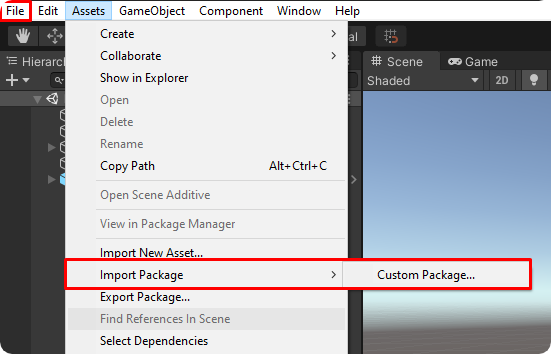
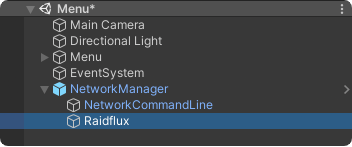
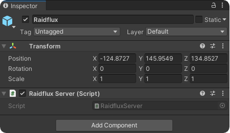

# Server side implementation 
:::important
Raidflux **ONLY** works with Linux game server builds!  
Don't worry the game itself can be build for any target!   
If you're not on Linux make sure you've added **Linux Build Support (Mono)** to your Unity version!  
Want to know how to add Linux Build Support? go [here](../preparing-unity.md)!
:::
Start by downloading our [Unity Plugin](https://drive.google.com/file/d/1LL7jPhPj3YCJxCeinv2I_uUItZyqelDF/view) and save the plugin to your preferred location. 

Inside Unity go to **Assets** -> **Import Package** -> **Custom package** and locate the plugin.


Once you have imported the Raidflux plugin, you will have access to a new class named RaidfluxServer. Locate your NetworkManager and add a new child gameobject called Raidflux and add the RaidfluxServer script to this gameobject as shown below:  



:::important
You might see some http errors or warnings in the logs, this is normal. This is because the init and report API's are only available when deployed in Raidflux's infrastructure.
:::

Once your game server starts listening for connections, initialize Raidflux with the maximum amount of players that  
can join this game using the `RaidfluxServer.Singleton.Init(...)` function like shown below:
```cs
networkManager.OnServerStarted += () =>
{
    if (networkManager.IsServer)
    {
        RaidfluxServer.Singleton.Init(uNetTransport.MaxConnections);
    }
};
```

Afterwards, you need to update the player count, each time a player joins or leaves, using the `RaidfluxServer.Singleton.ReportPlayerCount(..., ...)` like shown below:
```cs
private void UpdatePlayerCount(ulong id)
{
    RaidfluxServer.Singleton.ReportPlayerCount(
        networkManager.ConnectedClients.Count, 
        uNetTransport.MaxConnections
    );
}
```
An example implementation using Unity’s new MLAPI can be found [here](https://github.com/Raidflux/raidflux-unity-demo/blob/main/Assets/Scripts/Main/NetworkController.cs).  

Now you got this to work you've already finished the server side infrastructure of your game!  
Let's continue at the [Client side implementation](./client-side)!