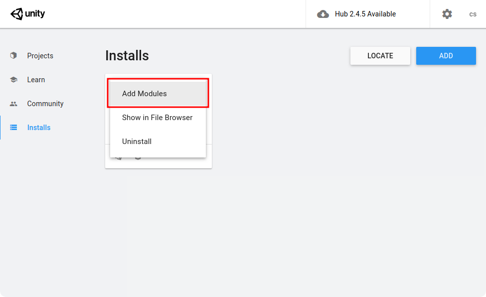

# Preparing Unity

## Adding Linux build support
Raidflux only supports gameservers build for linux. Unity supports compiling for linux out of the box, but it does require you to add the **Linux Build Support (Mono)** module via the Unity Hub application. Open the Unity Hub application and navigate to "Installs". Click the options icon next to the Unity version you want to use and select "Add Modules" as shown below

Select Linux Build Support (Mono) as shown below and continue through the steps to install the module.

