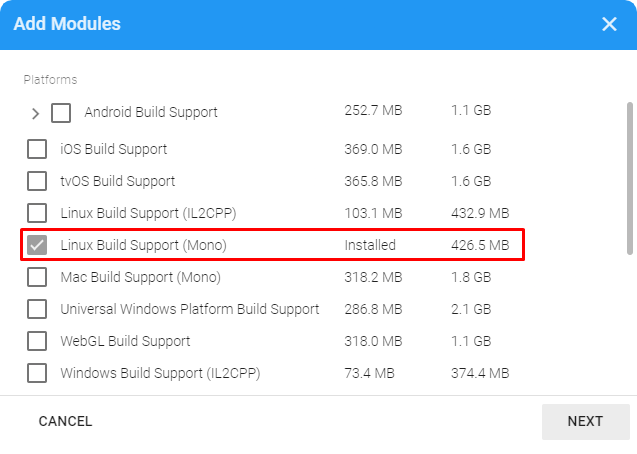

# Preparing Unity
:::important
Having **Linux build support (mono)** enabled is a **necessity** when working with Raidflux! If you're on Linux this should be enabled by default. You can check this by following the same steps shown below, It should **not** show LBS(mono) in the list.
:::
## Adding Linux build support
Raidflux only supports game servers build for linux. Luckily Unity supports compiling for linux by default, but, you do need to enable it before you can take advantage of this feature.  
Lets start by adding the **Linux Build Support (Mono)** module, using the Unity Hub application.  

Open the Unity Hub application and navigate to "Installs". Click the options icon next to the Unity version you want to use
and select "Add Modules" as shown below

Select Linux Build Support (Mono) as shown below and continue through the steps to install the module.

