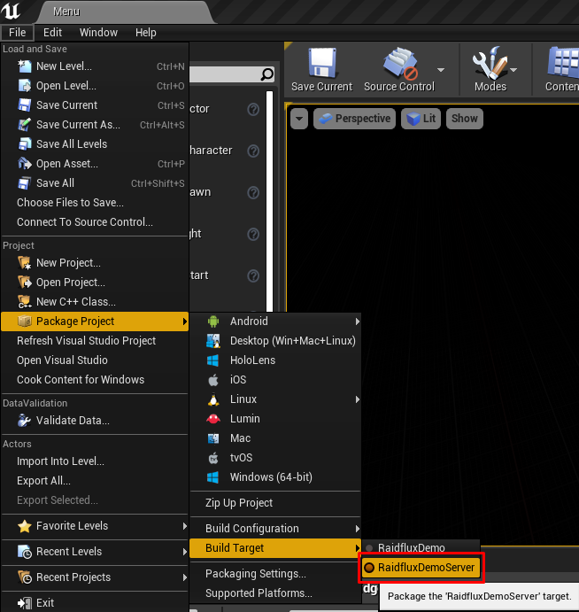
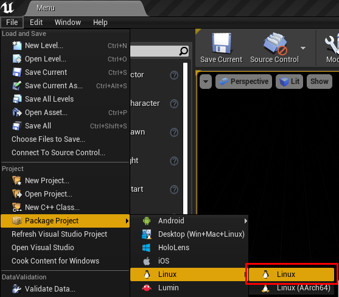
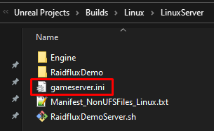
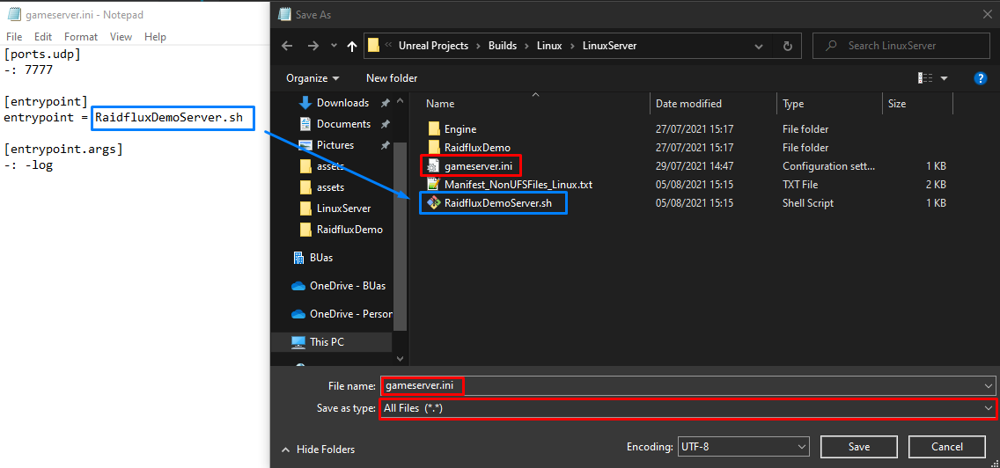

# Building your server

:::important
For this part you need to have a dedicated server build target, if you have not set this up yet, you can do that [here](./project-setup). You also need the Linux toolchain installed to build for Linux, if you have not done this yet, you can do that [here](./prepare-unreal)
:::

## Building

First, make sure the build target is set to your dedicated server target as shown below.



Next, make a server build for linux as shown below:



After you made a build, create a file called exactly:
```
gameserver.ini
```

In the root of your build directory as shown below:



Open the gameserver.ini with a text editor and paste in the following lines:

```ini
[ports.udp]
-: 7777

[entrypoint]
entrypoint = RaidfluxDemoServer.sh

[entrypoint.args]
-: -log
```

Make sure the value behind ```entrypoint =``` is exactly the same as the name of your linux build, as shown below:


You can use the key ```[ports.udp]``` to specify the UDP port your gameserver uses, Unreal Engine uses UDP port 7777 by default. Raidflux will use this to internally route traffic to your server. If your server uses TCP connections you can use the key ```[ports.tcp]```. If your TCP ports are used in combination with websockets, you can mark the TCP ports used as websockets using the  ```[ports.wss]``` key. The ```[entrypoint]``` key is used by Raidflux to locate your executable, make sure this is set to the exact name of your executable, this is case sensitive. If your server requires any command line arguments, you can use ```[entrypoint.args]``` to specify these.

Select everything in the folder and **compress** it into a **.zip** file.
:::caution
Make sure you've compressed it into a **.zip** file, other archive types can't be uploaded to Raidflux!
:::
You're done here, if you've already created a team continue at [Uploading your build](./../../raidflux-console/builds#uploading-your-build) else continue at [Teams](./../account-teams)