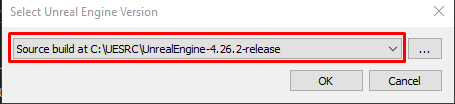
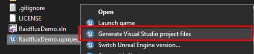

# Preparing the demo project

Start by downloading our demo project from https://github.com/Raidflux/raidflux-unreal-engine-demo

Right click the RaidfluxDemo.uproject file and click on "Switch Unreal Engine version..." to make sure it points to the version you just compiled from source as shown below

After that, right click the project and select "Generate Visual Studio project files" as shown below

That's all for now! Open the project and continue at [Building your server](../build) 
