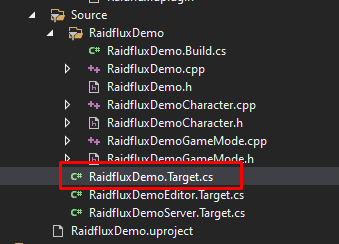
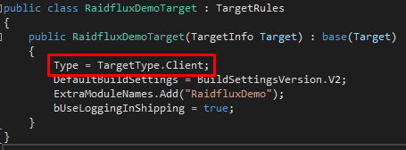
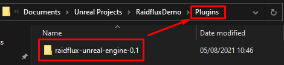
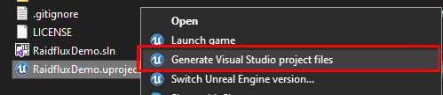
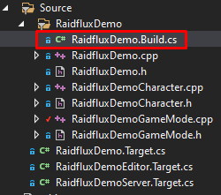
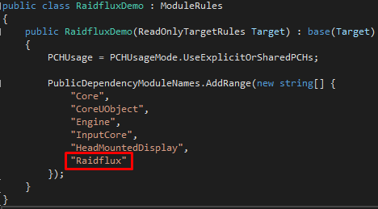
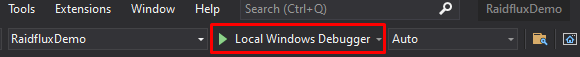

# Integrating Raidflux

:::tip
If at any point you need help implementing Raidflux into your game, feel free to contact us at support@raidflux.com or take a look at our example project at [Raidflux Demo Game](https://github.com/Raidflux/raidflux-unreal-engine-demo)
:::

:::important
Right now, it's not possible to use Raidflux with a Blueprint only project because our plugin requires you to compile C++. You can convert this quite easily by creating a new C++ project and simply copying over your content.
:::

## Dedicated server build target

First, you will have to add the dedicated server build target. To add your dedicated server build target, follow the instructions as listed here: https://docs.unrealengine.com/4.26/en-US/InteractiveExperiences/Networking/HowTo/DedicatedServers/

The last thing left to do now is to change the target of the game to the Client type. Open the default target for your game as shown below and change the type from ```TargetType.Game``` to ```TargetType.Client```




## Installing the plugin

If you haven't downloaded our plugin yet, you can go ahead and download the latest release from our [plugin's Github repository](https://github.com/Raidflux/raidflux-unreal-engine/releases/latest). Extract the plugin in the Plugins folder of your project as shown below. The Plugins folder should be located on the root of your project, if it does not exist, you can create it.



After that, right click the project and select "Generate Visual Studio project files" as shown below



You can now open the newly generated .sln file and open your Build config file (ProjectName.Build.cs). Now add ```"Raidflux"``` to your ```PublicDependencyModuleNames``` as shown below.






You can now start your development editor by pressing the "f5" key on your keyboard to build your editor project or by pressing "Local Windows Debugger" as shown below.



